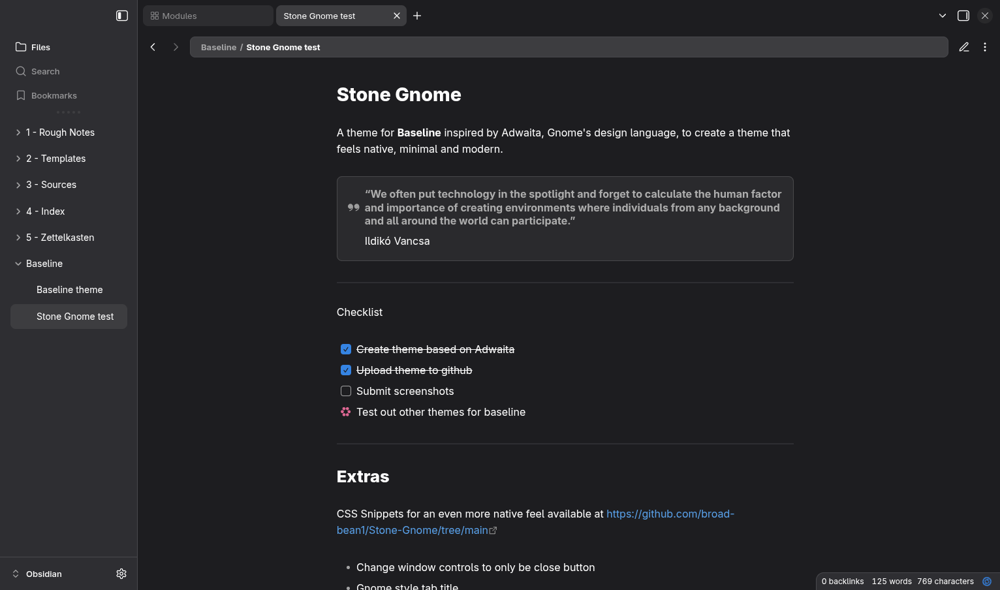

# Stone-Gnome
A baseline obsidian theme and a few css snippets to make obsidian look like at home on Gnome with an Adwaita style

## Theme 
You can download from the [Baseline marketplace](https://aaaaalexis.github.io/obsidian-baseline/marketplace/) or download and import the JSON file into the style settings community add-on 

## Snippets
You can download the CSS for each snippet and add them to obsidian by navigating to the bottom of the appearance tab in settings they do the following 

Clean workspace 
- Removes a divider between the tab bar and tab title bar for a more unified look

Gnome tab title style
- Adds a box around the tab title to resemble adwaita applications

Gnome window close button
- Replaces windows style minimise maximise and close with a singular rounded close button 
