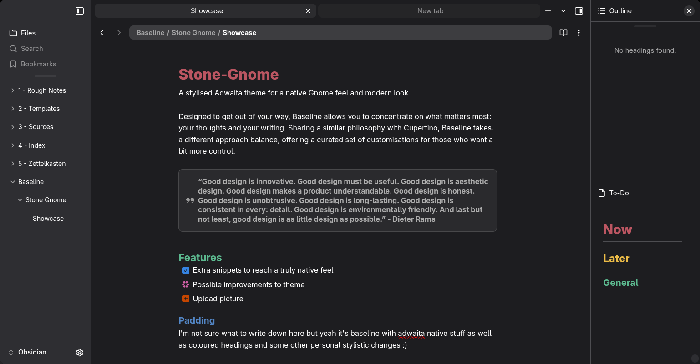

# Stone-Gnome
A stylised Adwaita theme for a native Gnome feel and modern look

## Baseline Theme 
You can download from the [Baseline marketplace](https://aaaaalexis.github.io/obsidian-baseline/marketplace/) or download and import the JSON file into the style settings community add-on 

## Snippet
Thanks to the great work of [@aaaaalexis](https://github.com/aaaaalexis) nearly all of Adwaitas defining traits are available by default in Baseline's Style Settings, due to this with the theme alone you can get 90% if the way but for some extra touches you can add my css snippet for
- No min/max window button
- Adwaita style tab title bar
- Adwaita style status bar
- Fix for tab titles
- Rounded window corners (This doesn't work amazingly on fedora for me but is still better than default, give it a go and see for yourself)
